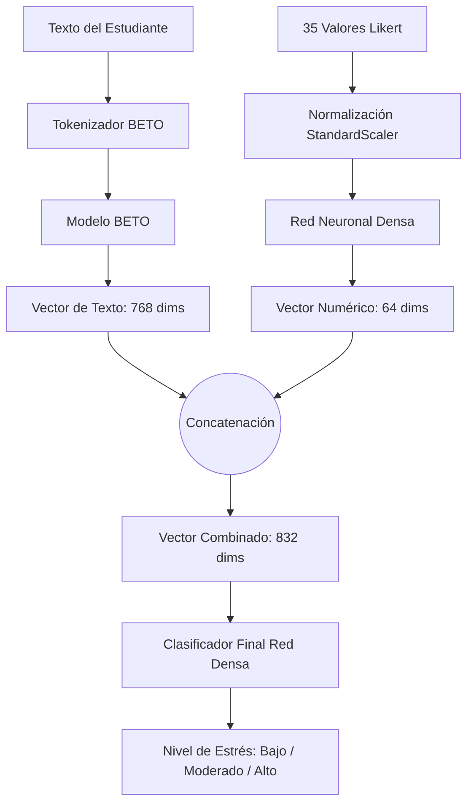

# Documento Técnico: Entrenamiento y Arquitectura del Modelo SISCO

Este documento detalla el diseño, la justificación de los datos y el proceso de entrenamiento del algoritmo de detección de estrés académico basado en el inventario SISCO.

---

## 1. Arquitectura del Modelo Híbrido

El sistema utiliza un **modelo de aprendizaje profundo híbrido** construido en PyTorch. Se denomina "híbrido" porque no procesa un solo tipo de dato, sino que fusiona dos fuentes de información diferentes en paralelo antes de tomar una decisión final:

1. **Rama de Texto Libre (Procesamiento de Lenguaje Natural):** 
   Utiliza **BETO** (`dccuchile/bert-base-spanish-wwm-cased`), un modelo Transformer preentrenado específicamente para el idioma español. Esta rama toma el texto donde el estudiante explica cómo se siente, lo procesa, y extrae el token `[CLS]`, que es un vector de **768 dimensiones** que resume el significado semántico y emocional del texto.

2. **Rama Numérica (Inventario SISCO Likert):**
   Procesa los 35 valores numéricos de la escala Likert (-3 a 3) a través de una **Red Neuronal Densa (Feed-Forward)**. Esta sub-red consta de capas lineales con normalización por lotes (`BatchNorm1d`), funciones de activación ReLU y `Dropout` (0.3) para evitar el sobreajuste. Esta rama comprime las 35 respuestas en un vector denso de **64 dimensiones**.

**Fusión (Concatenación):**
Ambos vectores (768 del texto + 64 del Likert) se concatenan creando un super-vector de **832 dimensiones**. Este vector pasa por un clasificador final (una red densa de 128 neuronas) que emite la probabilidad para las 3 clases de estrés: **Bajo, Moderado y Alto**.

---

## 2. Uso de Datos Sintéticos

La inclusión de datos sintéticos en la fase de entrenamiento fue una decisión de ingeniería de datos fundamental para el éxito del modelo. Sus propósitos y manejo fueron los siguientes:

### ¿Por qué se usaron datos sintéticos?
1. **Balanceo de Clases:** En los estudios psicológicos o encuestas reales, es común que una clase predomine sobre otra (por ejemplo, tener muchos estudiantes con estrés "moderado" pero pocos con estrés "bajo"). Los datos sintéticos permitieron equilibrar la cantidad de ejemplos por clase para que el algoritmo no se volviera sesgado (favoreciendo predecir siempre la clase mayoritaria).
2. **Robustez Semántica:** Entrenar un modelo masivo como BETO (que tiene millones de parámetros) con pocos datos de texto real puede llevar a un sobreajuste rápido (memorizar los textos en lugar de entenderlos). Los datos sintéticos aportaron variabilidad léxica y nuevas formas de expresar el estrés, obligando al modelo a aprender patrones generales de lenguaje en lugar de palabras específicas de los estudiantes reales.

### ¿Cómo se manejaron para no viciar los resultados?
El manejo de estos datos fue riguroso:
* **Separación estricta:** Antes de dividir los datos, se separaron mediante la columna `fuente`.
* **Entrenamiento Mixto:** El conjunto de entrenamiento (`train`) se formó combinando el 80% de los datos reales **junto con todos los datos sintéticos**. Aquí el modelo aprende.
* **Evaluación Pura:** El conjunto de prueba (`test`) se formó **exclusivamente con el 20% de los datos reales restantes**. 
* **Justificación:** Esto garantiza que la precisión reportada del modelo (~81%) sea una medida real de cómo se comporta ante humanos reales, ya que nunca fue evaluado sobre los datos sintéticos creados artificialmente.

---

## 3. Proceso de Entrenamiento

El entrenamiento del modelo combinó técnicas avanzadas para lidiar con el desbalance residual y la arquitectura híbrida:

* **Pesos de Clase (Class Weights):** Se aplicó `compute_class_weight="balanced"` a la función de pérdida (`CrossEntropyLoss`). Si un error se cometía en una clase minoritaria, el modelo era penalizado con mayor dureza que si se equivocaba en una clase mayoritaria.
* **Optimizador con Tasas de Aprendizaje Diferenciadas (AdamW):**
  * Para **BETO**: Se usó una tasa muy pequeña (`2e-5`). Como BETO ya viene pre-entrenado de Google/Chile, solo se hizo un *fine-tuning* suave. Si se usaba una tasa alta, sufriría de "olvido catastrófico" (borraría lo que ya sabe del idioma español).
  * Para las **Capas Likert y Clasificador Final**: Se usó una tasa mayor (`1e-3`). Al ser capas inicializadas desde cero con valores aleatorios, necesitaban aprender más rápido para alcanzar a BETO.
* **Programador de Tasa (Scheduler con Warmup):** Se utilizó un crecimiento gradual de la tasa de aprendizaje durante el primer 10% del entrenamiento (`warmup_steps`) para evitar desestabilizar los pesos de BETO en los primeros pasos, seguido de un decrecimiento lineal.
* **Gradient Clipping:** Se limitó la norma de los gradientes a `1.0` para evitar explosiones de gradiente durante la retropropagación, brindando un entrenamiento más estable.
* **Early Stopping implícito:** Durante las 10 épocas, el algoritmo evaluó las métricas en el set de validación puro (reales). Solo guardó el `estado_del_diccionario` (`mejor_modelo_hibrido.pt`) de la época que obtuvo la exactitud (accuracy) más alta, descartando épocas posteriores si el modelo empezaba a sobreajustarse.
